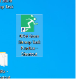

# Practice Stroop Task

*This task can be completed during optode population or when connecting the computers*
 
1. On the EPRIME computer open the icon named “0Pet Store Stroop Task Practice - Shortcut” which is pictured below:
- Type in the subject ID, session number, then click “Yes” to continue.
- Make sure the computer is not on mute and give the child headphones or earplugs 

2. Run the practice task by reading instructions out loud to the child.  If the child is not completing the task correctly, stop and explain the task in a different way 

*Try making the animal sounds and pointing to the picture of the correct animal or ask the child to repeat the directions back to you.  You can give the child as much help as possible during the practice.*

- The participant must get 83.33% (5 out of 6 right) on the second set of trial practice to proceed to the main task. 
- Repeat 2 times if the participant does not reach the baseline score. 
- Record the scores on the [recording sheet](https://docs.google.com/document/d/1fcRvpEBTaAPpj6JfiY-YMB9vAcc-Cb1iEa_KsbjfAf0/edit?tab=t.0)