# Connecting Computers Protocol 

For the following steps under this section: **EPRIME Computer Tasks → bold**; *fNIRS Computer Tasks → italicized*; Both computers → normal text

Note:
#### EPRIME and fNIRS 1 computer- 
- Username = .\install
- Password = Winter1T3! 

#### EPRIME and fNIRS 2 computer-
- Username = .\DANCE
- Password = Develop209!

1. With BOTH computers, click on the Network Internet Settings, and connect both computers to the TP-Link (“TP-Link_E800_5G”). 
2. Make sure the TP-Link (small white box) access point is plugged into the wall outlet and turned on.     										

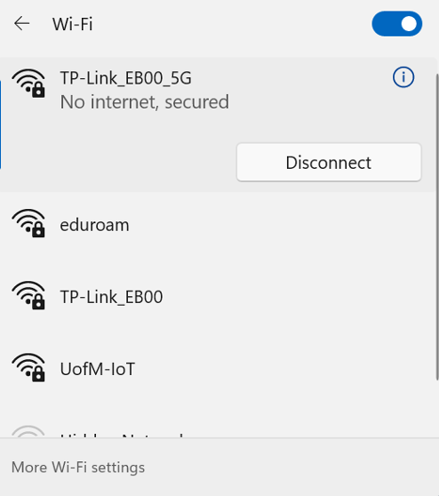

The computer should say no internet: that is CORRECT

**3. On the EPRIME computer, press the windows button and the R key at the same time which will take you to the the application “Run”**
**4. In “Run”, type “cmd” in the “Open:” space and then press ok**

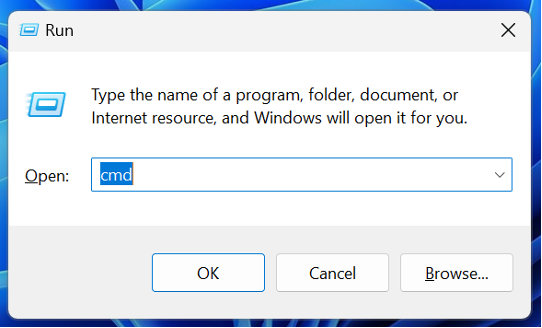

**5. A coding page will pop up after you complete step 4.  Type in “ipconfig” directly after the “Install>” line of code.  Then press enter.**

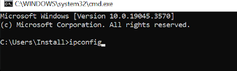

**6. Record the value for the default gateway that is provided from the EPRIME computer**

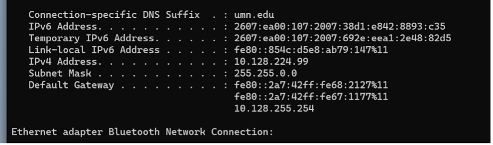

*7. On the fNIRS computer repeat steps 2-3*
*8. Once coding page has opened, type in “ping” after “Install>”, the press space*
*9. Type in the default gateway number (which will be 192.168.0.1) retrieved from the EPrime computer. Click “enter”*

10. Minimize both applications. Both computers will now be connected to each other. 

## Data collection (computer) protocol

Begin once the participant has finished and passed the practice test and the NIRSport machine is turned ON

**1. On the EPRIME computer open the icon named “0Pet Store Stroop Task”**

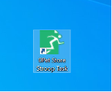

**2. Enter participant information according to their session number and participant ID**
**3. You will now see a screen that says “Waiting up to 30 seconds for LSL consumers” on the EPRIME computer**

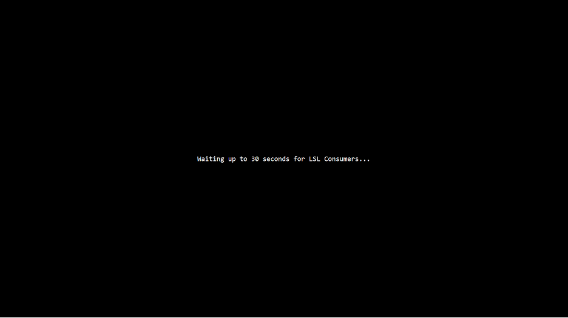

*4. Open Aurora on the fNIRS computer*

*5. Connect  to fNIRS device 1 (0453) or device 2 (0448) depending on which machine you choose to use.*
*- If the device doesn’t show up, click Refresh list at the bottom*

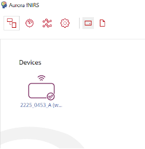

*- Click Select Device located on right side  (check mark will appear on the device icon)*
*- Restart the Aurora or the fNIRS machine if you cannot find the device.*
*6. Go to the montage (top bar last page icon “open list of configurations") and click the montage that will be used (dlPFC_TPJ_SC_2) - check mark will pop up*

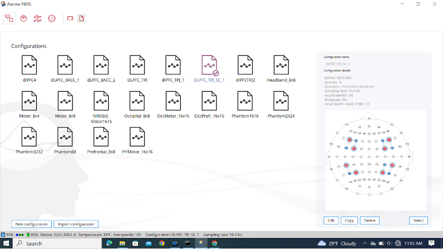

*7. Press the “Edit” button on the bottom right of the Aurora.*

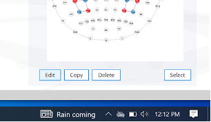

*- MAKE SURE the task is opened on the EPrime computer and is waiting on the “Waiting up to 30 seconds for LSL connection”*

*8.  After pressing “Edit”. Go to the “LSL stream names” tab then click on the “Test Connection”*
*- The connection works when using the real Stroop Test and would fail for the practice Stroop test.*
*- Change the “Trigger” in stream name to “E-Prime”.*
*- Change Fallback Trigger number to “9”*

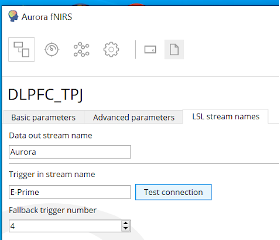

*When the connection is successful, the window below will show up. Then press “save” on the top right then continue with signal calibration.*

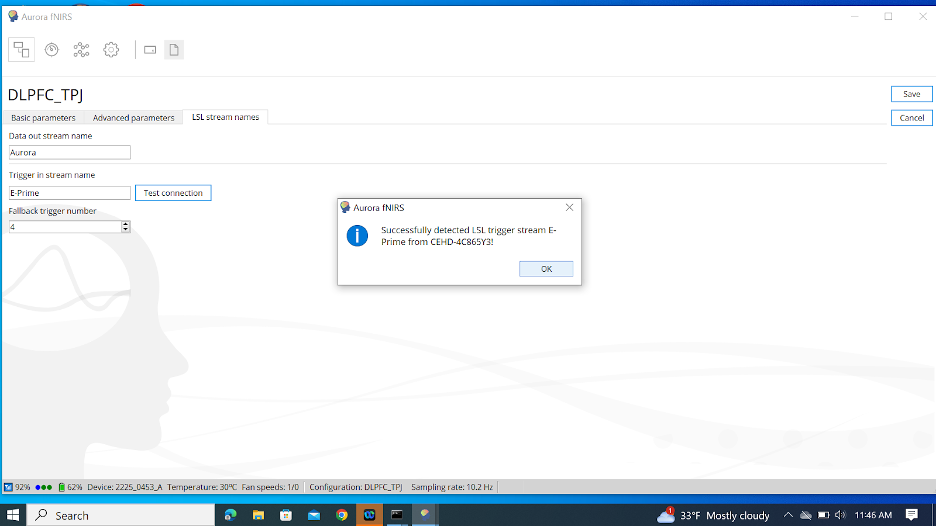

