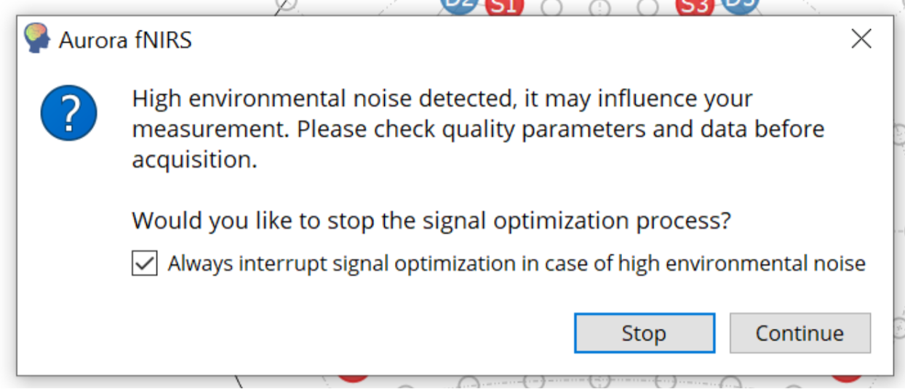
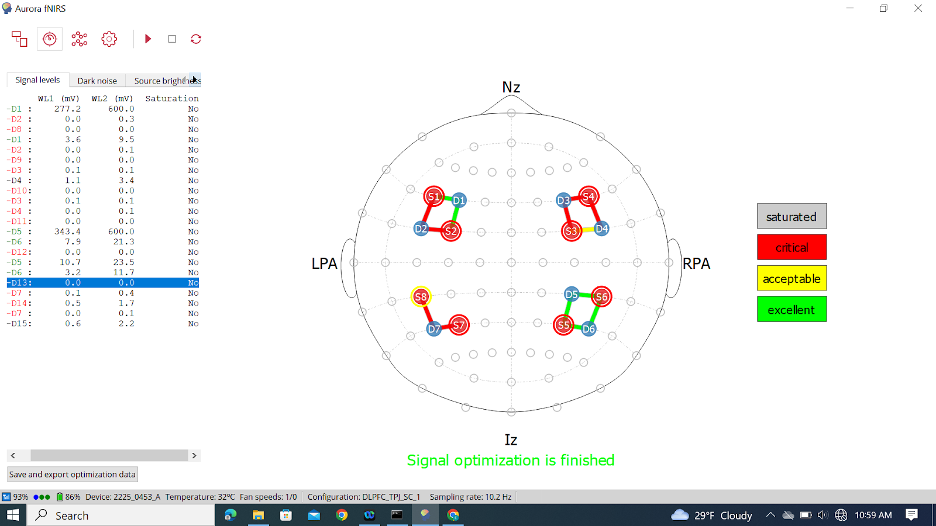
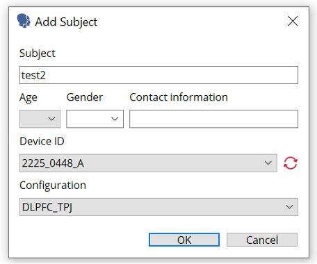

# Calibration and Recording 

Begin protocol **only** once correct cap size is determined, cap is populated, computers are connected, and practice Stroop test is complete.

*Ensure cap is correctly placed on the participant’s head- re measure Cz and 10% point.*

1. On the fNIRS computer, navigate to the  signal level optimization page (meter icon) on the dashboard. Press the red play button to start the calibration.

- Note: A pop-up window may appear shortly afterwards. If so, please click Continue.

2. Once the signal optimization is complete, you will see a window like the one shown in the picture below.

3. You can also click the continuous optimization button (two red arrows in a circle) on the top to see a real-time signal update.   
- *Note: Red circles indicate poor SDD, red lines indicate poor light source connection*

4. If you need to fix a poor signal, please remove the single optode from the fNIRS cap and use the white hair-parting tool to part the hair to expose the scalp without drawing the hair out of the cap. If the poor signal is in an area with lots of hair, you may try increasing the tension of the Spring Topper. You may try spring tension 3.
- *Note: Aurora will not check the signal in real-time, as you place the optode back into the fNIRS cap. If only one subject needs to check the signal again, you can only click the same icon (red play one) in his line.*

5. **Tips for troubleshooting**
*Network connections*
- Make sure the TPlink is connected to power and the connection is not to either of the individual NIRsports devices.
- If the WiFi does not want to find the NIRSport machine, turn it off and on, try several times. Charge it. If not, change another device. 
- Try turning the designated laptop on and off.
*Parting the hair*
- If the issues lie with the individual signal channels and optodes, try taking off the problem optodes, the ones with no good connections, and moving the hair away to the side with the hair parting tool. Additionally, you can use a higher level spring optode (i.e. if you used a level 2 then switch to level 3).  
*Short Distance Channel (SDD)*
- Knowing that the light source of the SDD is in the back of the plate, make sure to part the hair in the back where you cannot directly see anything. 

6. Please continue the process of fixing poor signals, into which all the channels are green, or above yellow. Record the signal level on the fNIRS run sheet and take a screenshot of the signal optimization screen - using the “prt sc (F10)” button on the keyboard or search “Snipping Tool”. 
> *Note: After 15-minutes of fixing poor signals, or at most three times of optimization, ask the parent if you can continue fixing the poor signals as needed, until it is time for the child to complete the activity*

7. After the signals have been fixed appropriately. Put the shower cap on the child’s head.
8. After the signals are fixed, open the fNIRS recording tab using the two waves/curves button, **then start the recording using the red circle record button** 

## Recording:
1. After completing the signal calibration and troubleshooting and **making sure the signals are both recording, we can start our Stroop test.**
2. When the Aurora asks for subject information: 
- Subject: randomized ID number
- Age: Put the age of the child
- Gender: Put gender of child participant

- 4.Contact: leave contact blank
- Device: 2225_0453_A or 2225_0448_A
- Configuration: dlPFC_TPJ_SC_2

3. On the EPRIME Computer press the black button to begin the experimental task (the pet store game should be open)
- Ensure that volume is at a reasonable level 

4. Begin the Stroop task.  The game should guide the child through the task.  Do NOT interrupt the game or interact with the child.  

