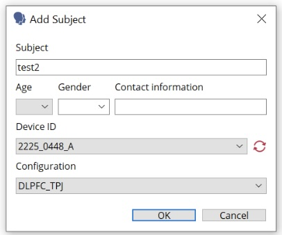
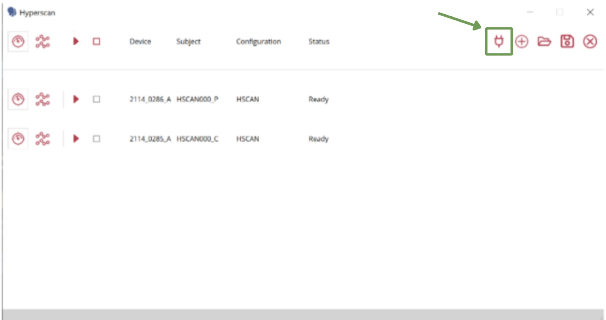
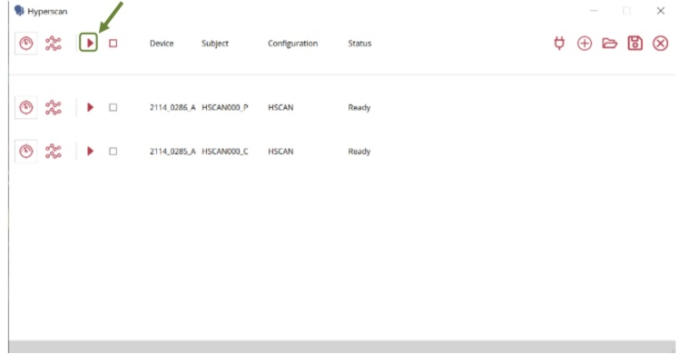
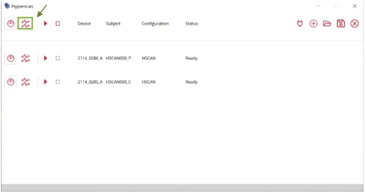

# fNIRS Hyperscanning Protocol

## fNIRS Capping 

Begin protocol once correct cap size is determined and cap is populated for both participants.

Ensure cap is correctly placed on the participant’s head - re measure Cz and 10% point.

## Protocol

1. Turn on both of the NIRX batteries and make sure F2 and the power button are both green
    - This may take a few seconds

2. Ensure the fNIRS computer is connected to the TP-Link (“TP-Link_E800_5G”). Only the fNIRS computer is used for hyperscanning. The EPrime computer is not needed for this protocol.

2. Open the **Hyperscan icon**. 

3. Navigate to the plus icon and add a subject.

4. Record **subject ID, age, gender**, and choose the **device ID and configuration** (leave contact information blank)
    - If device ID and configuration do not pop up, check that the computer is connected to TP Link or if TP link is on (two green lights). You might also need to restart the battery boxes and start the protocol over again

5. Repeat steps 3 and 4 to add a second participant.

6. Press the **plug icon** next to the plus icon to connect all devices.

    - If devices do not connect, check that the computer is connected to TP Link or if TP link is on (two green lights).
7. When both devices are connected and ready, optimize both devices by clicking the **play button**.

8. If both devices are optimized, connected, and participants are ready, you may record data by clicking the **record button** (looks like molecules).

9. Two aurora windows will pop up after you press record. DO NOT CLOSE THEM. Minimize them.    