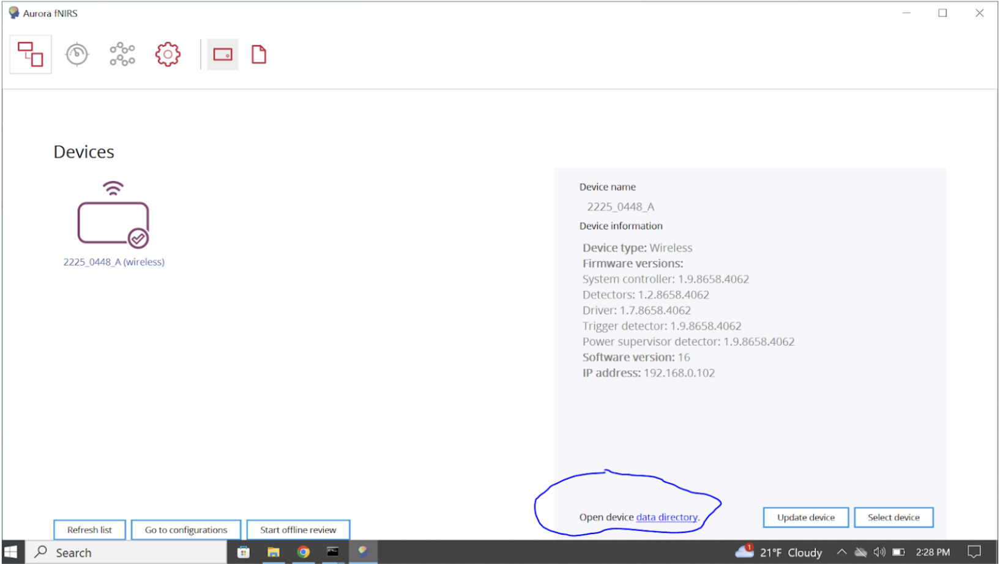
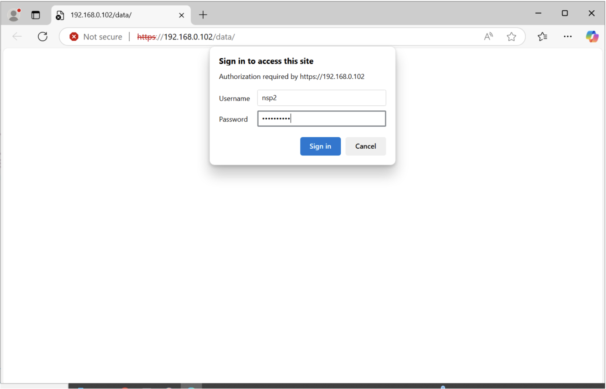
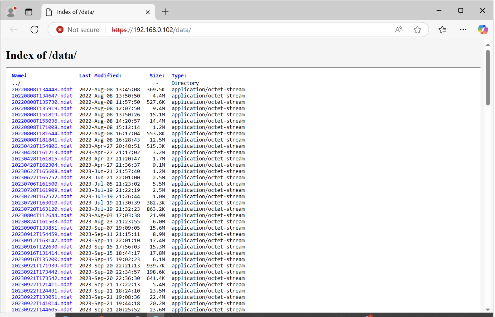
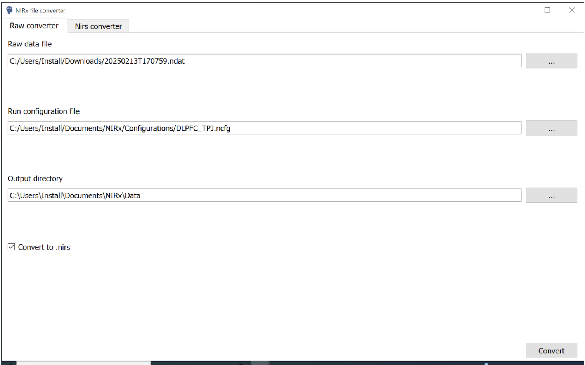

# Retrieve fNIRS data from Device

### (refer to Aurora fNIRS User Guide, Version 2023.09, Section 9.2)

### fNIRS Device Connection to Computer Via Router
When operating in the Wi-Fi mode, it is possible that the connection between Wi-Fi and computer may be lost, and data was not recorded properly on the computer. In this case, you will need to retrieve the data from the data directory **immediately after data collection.**

## Materials 
1. fNIRS Device used during data collection session
2. fNIRS Computer (with Aurora downloaded)
3. fNIRS router (e.g. TP Link)

## Steps

1. First, you will use the fNIRS computer to open Aurora and connect the fNIRS device via router (e.g. TP Link) (see [connecting computers guide](https://dance-lab.github.io/DANCE-Wiki/docs/fnirs_protocols/connecting_computers/) for further instructions). On the Aurora setup page, make sure that you see the device name then click on button “open the data directory” on the lower right side of the screen (circled in blue).

2. Clicking on the `data directory` link will take you to a new website where you will be prompted to enter a username and password. This username and password is universal to all fNIRS devices. 
> **username:** nsp2
> **password:** dataaccess

3. The site will populate with all data stored on the fNIRS device. Choose the data that you need to backup and download it. All data are stored in a `.ndat` format. Data files can be distinguished by name, date colleected (last modified), and size. Note that the fNIRS device has finite storage and data will be overwritten once storage is full. 

4. If downloading data collected during hyperscanning, ensure that you have downloaded data from **both** devices, following steps 1-3. 

5. Exit Aurora and open "NIRS Converter". Open the data file(s) you have just downloaded from the device and add the correct configuration (e.g. DLPFC_TPJ or DLPFC_TPJ_SC. For more detail, see [connecting computers protocol](https://dance-lab.github.io/DANCE-Wiki/docs/fnirs_protocols/connecting_computers/)), choose your output directory, and click `Convert`. The file will then be converted to the file format Aurora produces (`.nirs`) and the file will be saved to the directory specified. 

