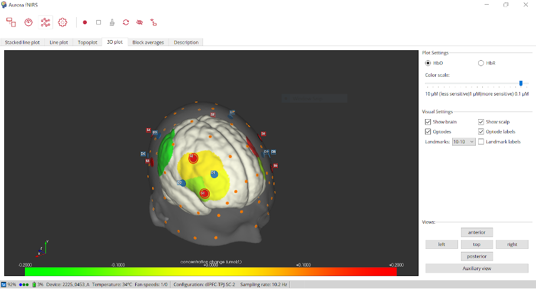

# Participant Debriefing

1. Turn off recording (square icon) then show them their 3D model brain (Navigate away from the Stacked line plot tab and click the 3D plot tab). Like the picture shown below. 

2. Thank the kid for doing such a great job and ask them if they have any questions 
3. Give the child a gift. Thank parent and child for their participation.  
