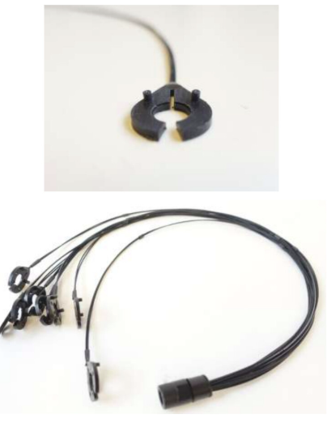
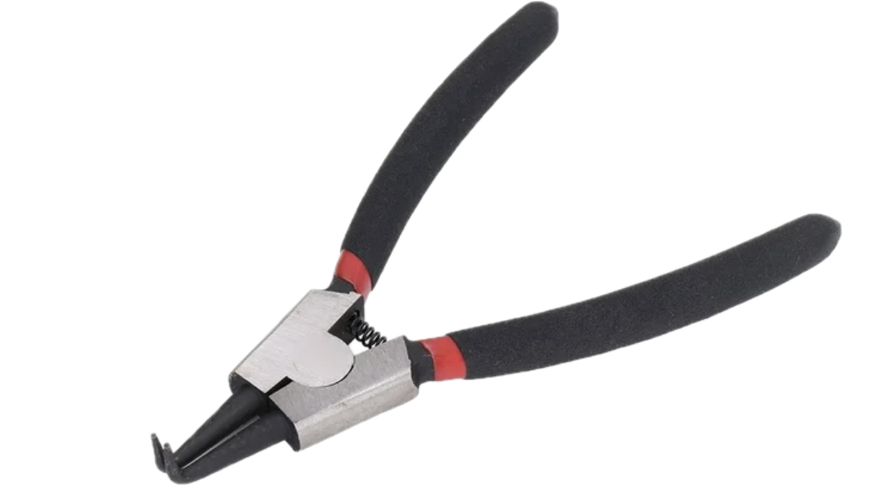
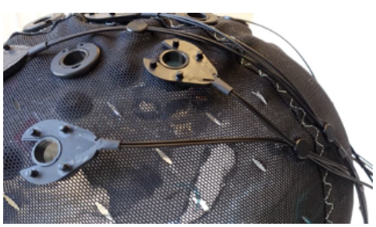
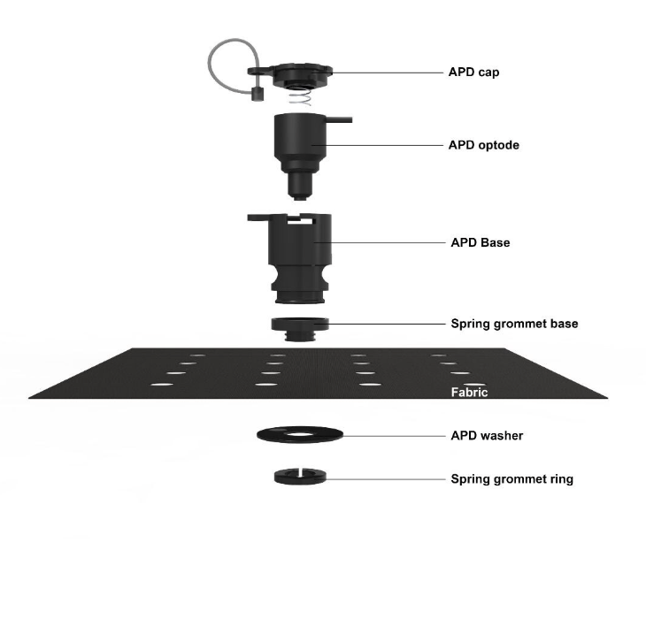

# Setting up short distance channel protocol**

*Complete this protocol before you populate the source and detector bundles*
Short distance channels lie on the inside of the fNIRS cap and connect to the grommets that hold source optodes during data collection. Short Distance Channels improve the quality of the fNIRS data we collect and are becoming the gold standard in fNIRS research. They pick up information about blood flow in between the scalp and the brain, allowing us to more accurately isolate cortical activity during data analysis. The channels can be a little finicky and take more time to set up than normal cap population with the source and detector optodes. 

## Materials:
- 1 short distance channel bundles 

- Reverse action pliers 

- 1 fNIRS cap 

- Short distance channel organizers 

*See photo above: organizer is small plastic circle holding short distance channel wires in place*

## Protocol:
1. Turn fNIRS cap inside out and stretch over the mannequin 
2. By using the reverse action pliers, remove the “spring grommet ring” (see photo below) for all the **source** grommets 

3. You may need to turn the cap back and forth to determine which grommets are **sources**
4. Hold the short distance channels by the plastic black piece (not the wires) and slide them over the back side of the grommet 
5. They will side over the part you removed the spring grommet ring from
6. Once all short distance channels are placed in respective grommets organize the wires using the “short distance channel organizers” (small black circles that hold short distance channel wires flush with the cap)
7. Take two of the short distance channel wires and place in the groove on the organizer 
- *Note: the groove side of the organizer will be facing out on the outside of the cap*
9. Push the organizer through one mesh hole in the fNIRS cap 
10. Adjust the wires so that they are straight but not pulling *See photo below for proper placement*

11. Turn cap over and begin populating fNIRS cap protocol. The end of the short distance channel bundle will be coupled with the detector optode bundle. 

