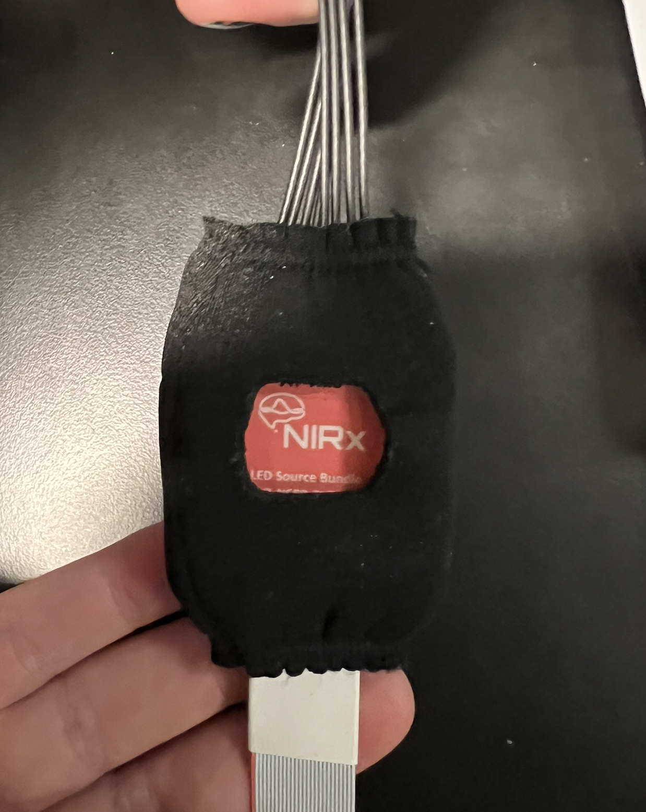
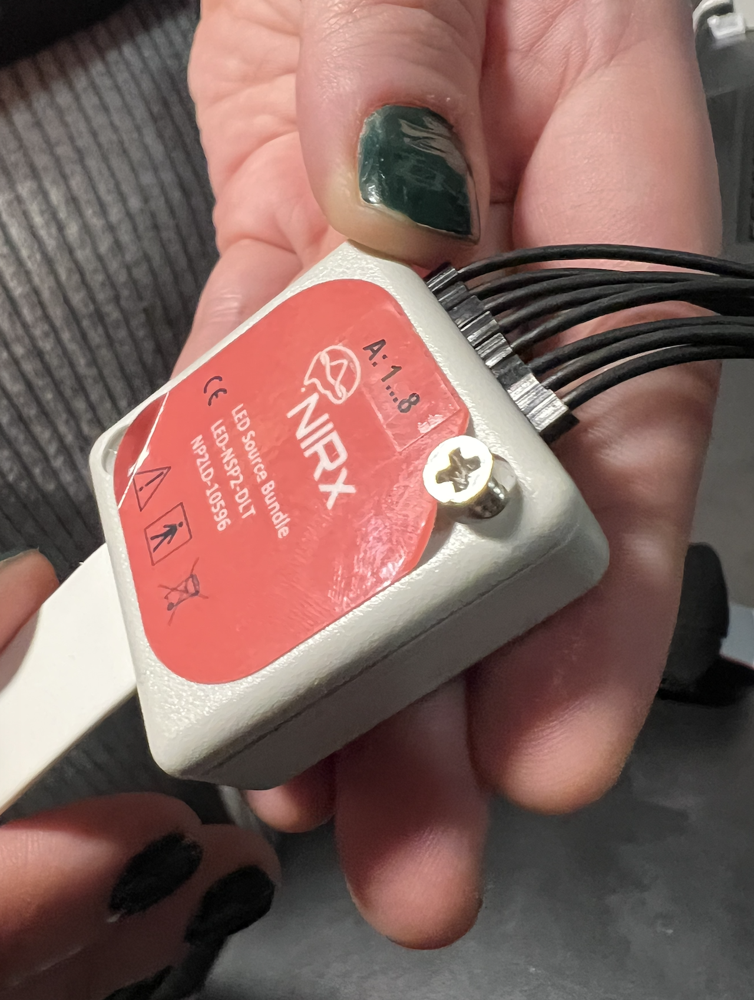
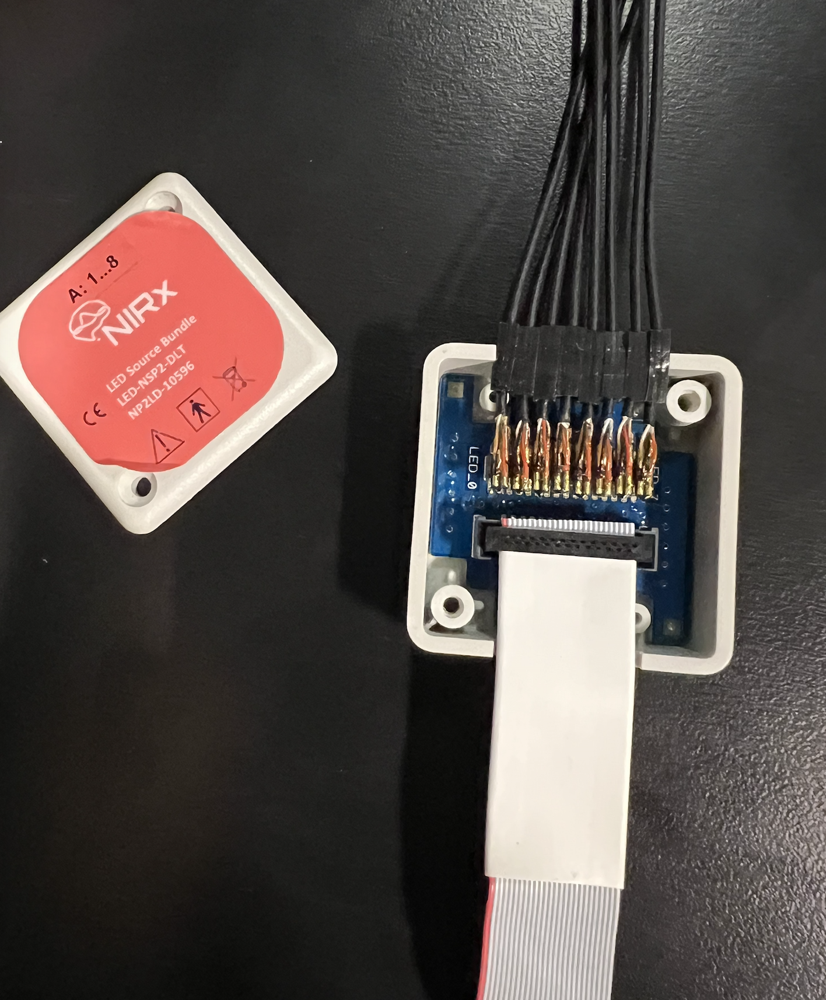
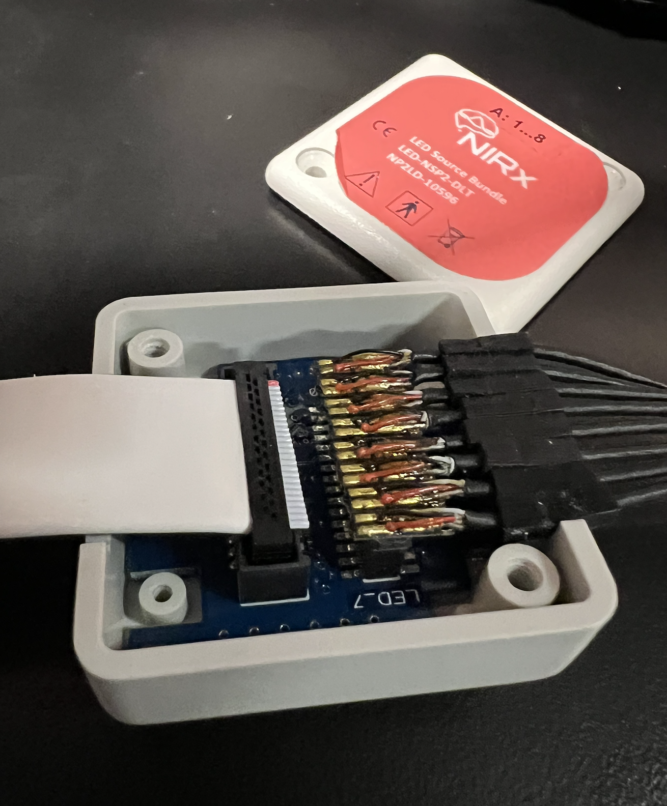
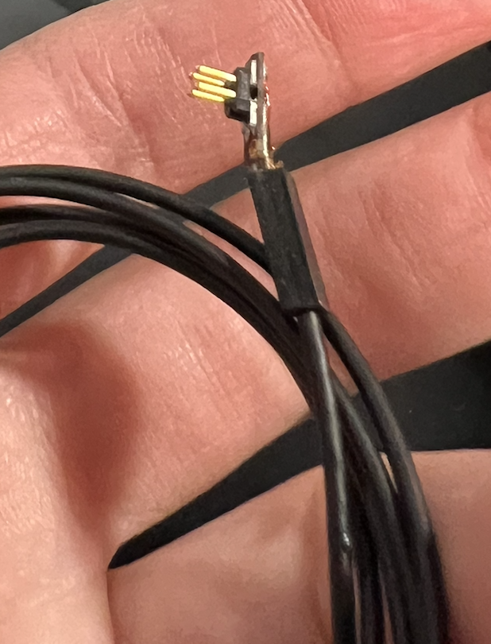
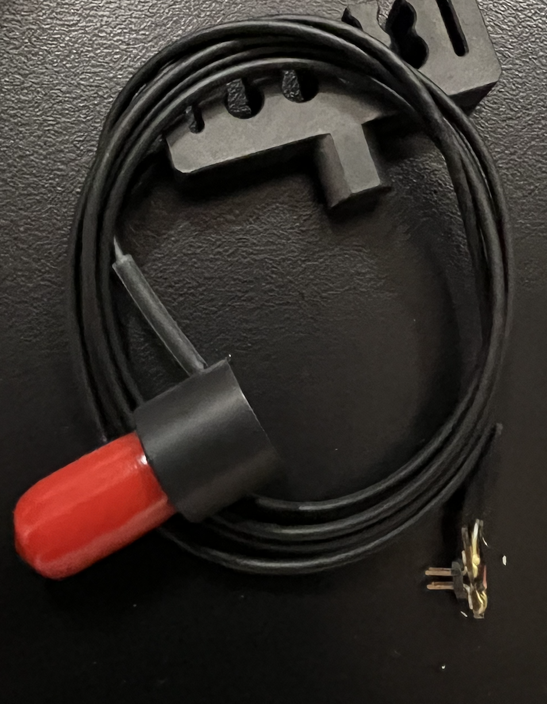

# fNIRS Hardware Technical Troubleshooting 

**NOTE: DO NOT execute this protocol without informing and receiving permission from lab manager or PI**

## Source and Detector Cable Troubleshooting

**Materials:** 

- Phillips Head #1 Screwdriver

**Procedure**

Occasionally there can be a hardware issue in one of the source or detector cables causing poor, unreliable, or unstable connection with the fNIRS device. You will notice that something has gone wrong when phantom testing reveals one or more optodes that are achieving very poor signal, even in completely dark connections. If you have identified a persistent connectivity issue in a source or detector cable, you may need to manually access the circuit board for each device to check each wire's connection. *Under no circumstances is this procedure to be done without initially consulting either the DANCE lab manager or PI*

1. Identify the circuit box on either the source or detector cable

2. You may have to remove the fabric protector in order to access the circuit board. Remove the fabric protector, slipping it off over the **optode end** and not the end that plugs into the NIRsport device. Be very careful with the optodes when removing hte cover.

3. Gently peel up the upper right corner of the sticker covering the circuit box cover to reveal the screw below

4. Unscrew the box on either the source or detector bundle to access the circuit board below. Use the lab Phillips Head #1 screwdriver to remove the screw. 

5. Note that the box contains two main components: a ribbon cable (white, the wide stripe that connects the circuit box to the end htat plugs into the NIRSport device) and a section where each individual source or detector optode connects to the circuit board. You will need to check the integrity of both sections of the box. 

6. Check the ribbon cable. Sometimes the ribbon cable pops up and disconnects from the circuit board below. If this is the case, the ribbon cable can be gently pressed back into position and will click into place. If the ribbon cable is not clicking back into place or is continually popping up, the box can be fitted with a small piece of foam that will help keep the ribbon cable in place. 

7. Check each ofthe optode cables. Each cable has four prongs that connect to the circuit board. Sometimes these prongs become loose and can be pressed back into place in the circuitboard. Make sure to look carefully at each place where the prongs connect with the circuitboard, and gently press any loose connection points to secure them again.

8. Occassionally optode cables get so damaged they must be replaced. Conveniently, we have an extra source and an extra detector cable that can replace whichever optode has become damaged. They can be found in small plastic bags, and are kept with the rest of the extra spare equipment in the testing control room. One of the extra source cables is pictured below: 

## Aurora Troubleshooting 

Sometimes the issue lies in the software or the firmware. Occasionally bugs are identified in older versions of aurora, and it is important to keep our software up to date. **NOTE: software and firmware should NEVER be updated in the middle of a project and NEVER done immediately before data collection**

If you are unsure whether there is a problem with a software or unsure how best to update it, you can always submit a help ticket. For more information on how to submit a help ticket, see the [fNIRS Technical Support SOP](https://dance-lab.github.io/DANCE-Management/docs/fnirs_protocols/fnirs_support/)

## Router Troubleshooting

Occasionally the router fails to successfully connect the fNIRS device with the computer. Sometimes this may be an issue with the router, or it may be an issue with the device. When in doubt, connect the fNIRS device to the computer with a usb cable to get the most reliable connection. Further issues with the router can be troubleshooted after data collection, and any bigger isseus can be addressed by submitting a help ticket (see the [fNIRS Technical Support SOP](https://dance-lab.github.io/DANCE-Management/docs/fnirs_protocols/fnirs_support/) )