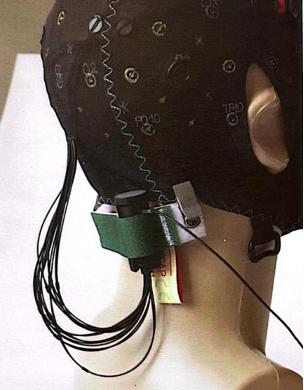
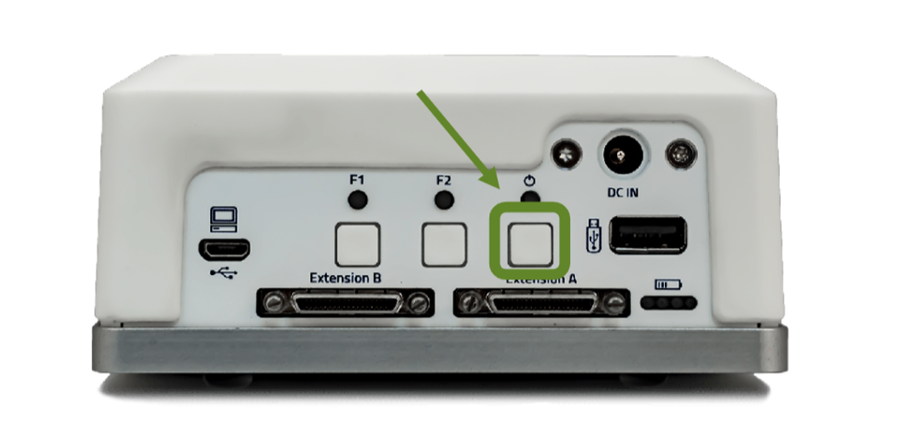
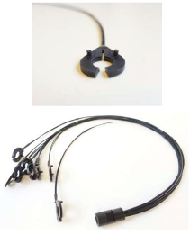
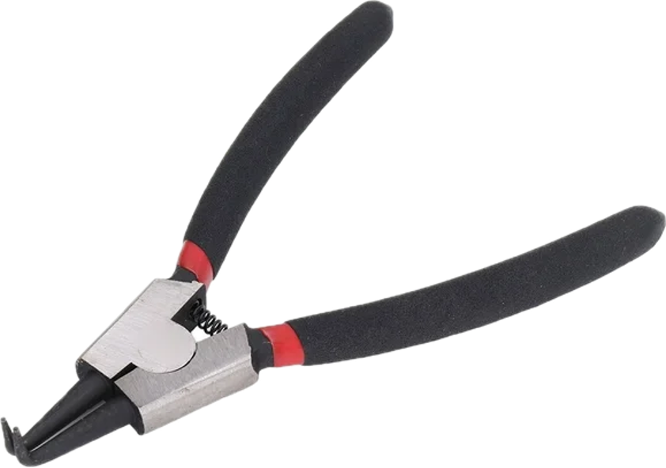
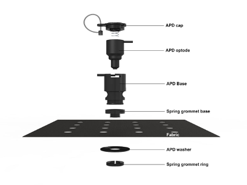

# Populating fNIRS Cap

### Materials: 
- Correct race (Asian/Caucasian) and correct cap size (50-60cm)
- 1 source (red), 1 detector (blue) bundle 
- Appropriate springs (choice between pressure 0-3) *see appendix A*
- 1 Short distance couple *see appendix B*
- 2 cable trees 
- 1 Velcro strap (green clip) *see appendix C*
- 1 Short distance channel fiber optic wires *see appendix D for set up*
- 1 NIRSport machine (white box: plug in to charge after use) *see appendix E*

## Protocol:
1. Place the correct cap onto the mannequin head
2. Remove the silicone electrical caps from the source cable bundle and the detector cable bundle
- *place caps back in container to return back to the light sources once protocol is complete*
3. Populate all the sources and detectors onto the cap, except for detector #8
4. Choose the appropriate level springs to secure the source and detectors into the correct grommets
5. Match the source number (red) with the correct grommet number (#1 is placed in #1 grommet)
6. Match the detector number (blue) with the correct grommet number (#1 is placed in #1 grommet) 
7. Place on the left side of configuration first, then the right side. 
8. Make sure all the cables are placed in the middle of optodes. 
9. Don’t directly pull on the SDD channel.  
10. Make sure the cable lines are not too tight nor too loose, and are organized. 
11. Populate detector “A” in number “8” grommet (#8 detector light source should not be attached to the cap at this step)
12. Place both cable trees into the holes at the bottom of the cap 
13. Organize cables into their cable trees (left side of the cap cables go with the left tree and right side of the cap cables go with the right tree)
14. Attach the velcro strap (the green clip) onto the cap
15. Couple the short distance probe bundle to detector 8 by using the orange coupler. Detector 8 with the bigger side, and bundle on the smaller side. *see appendix B for picture*
16. Attach the green Velcro strap over all wires and short distance channel couple *appendix C*
17. Plug the white end piece from the source and detector cable bundles into the NIRSport machines (source cable plugs into “source a” and detector cable plugs into “detector a)
18. Turn on the NIRSport machine by holding down the power button until the light turns green *appendix E* 
19. Put the fNIRS machine into the backpack that the participant selected 

#### Appendix A:
- Choose the spring pressure depending on the individual’s hair type. 
- For adults, we will always start with 2 at the front (DLPFC region) and 3 at the back (TPJ region)
- For children, the springs will be determined after observing hair type (see hair type chart below)

| ----------- | ----------- |
| Skin without hair | Spring Pressure 0 |
| Children, lighter hair color, thinner hair, low hair density | Spring Pressure 0 or 1 |
| Adults, darker hair color, thicker hair, high hair density | Spring Pressure 2 or 3 |

#### Appendix B:

Short distance channel couple 

#### Appendix C:

Green Velcro organizer (place short distance channel couple inside the green Velcro) 

### Appendix D:
*See Short Distance Channel Protocol*

**Appendix E:**

White NIRSport battery box 

### Photo album:
- **A**

Short distance channel bundle *note- these wires are fiber optic wire and are VERY fragile; please do not bend or handle roughly*

- **B**

Reverse action pliers used to remove spring grommet ring 

- **C**

The spring grommet ring is on the inside of the cap and is to be removed when placing short distance channels (keep ring is safe place so that it can be returned to the cap after data collection)

- **D**

Small circular black piece is the short distance channel organizer 