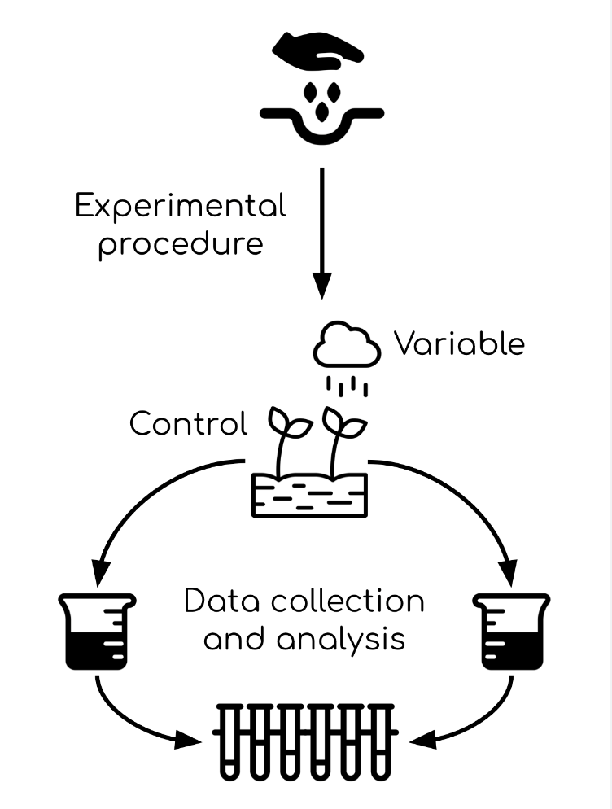

# Guide for CPSY4994 Final Paper: How to Write a Research Proposal

## Proposal Structure

You will write a short research proposal at the end of the semester. The proposal should be between 2 and five pages (double-spaced, 12 point font), and should clearly and concisely lay out your research motivation, aims, and intended protocol. This proposal can be on any research topic of interest, as long as it falls under the DANCE Lab umbrella (i.e., pertaining to research in development, affective neuroscience, culture, and/or emotion). You will also create a conference-style poster outlining each section of your proposal and including one methods figure to help your audience better understand your intended research protocol. 

Your proposal should include the following sections: 

### Abstract
Provide a ~100 word summary of your proposal. Make sure to highlight your research question, research aims, and briefly outline your methodology. This should act as a road map or a preview of your proposal contents for anyone reading your paper.

### Introduction/Objective
The introduction is an opportunity for you to introduce your objective. Explain your research question, your hypotheses, and your research aims. This section requires a very strong thesis sentence(s) that should capture the motivation of your paper. 

>Thesis sentence: Your thesis should outline and briefly justify and explain the significance of your research problem before laying out your research aims. 
>For example: **While traditional cakes, when consumed, have been shown to significantly improve participant mood and provide an effective solution to a Bad Day, few effective gluten-free options exist for individuals who cannot consume flour-based confections. This study aims to develop an equally delicious gluten-free cake recipe through the systematic evaluation of several flour-alternatives, which shall rated by both gluten-tolerant and gluten-intolerant populations using the Cake Tastiness Scale.**
>This thesis clearly outlines subject (cake tastiness), the research problem (few effective gluten-free alternatives exist), and the significance of this research problem (that cakes are an effective solution to a Bad Day). It goes on to clearly state the study aims (to develop an equally effective gluten free recipe) and briefly outlines proposed methods (to evalute success using the Cake Tastiness Scale in both gluten-tolerant and gluten-intolerant populations). These sentences clearly let your reader know what you hope to accomplish in your study and let them know what to expect in each section of your proposal. 

At the end of the section, clearly state your hypotheses. You may even write them out at the bottom of your introduction: 

- **H0: Implementation of flour alternatives in the cake recipe will fail to improve the scores of gluten-free cakes on the Cake Tastiness Scale**
- **H1: Implementation of flour alternatives in the cake recipe will improve the scores of gluten-free cakes on the Cake Tastiness Scale**

>Note: In this proposed study, the independent variable is flour/flour alternatives, and the dependent variable is cake tastiness. This study will evaluate the impact modulation of the independent variable (flour type) has on the dependent variable (cake tastiness).

### Significance
The significance section is your opportunity to convince the reader that the research project you intend to carry out is importance and worth doing. In this section, you must clearly highlight the gap in the literature that your study is addressing and explain WHY it is important that you help fill this gap in the literature. This is your opportunity to draw from existing literature. Use findings from existing research studies to explain why your project is necessary to carry out. 

>For example: *Smith et al., in their recent study on food-related affect and well being, found that individuals who self-identified as being physically unable to eat cake reported significantly lower scores on the PHQ-9. Moreover, in an EMA investigation of food and happiness, Doe et al. demonstrated a far stronger negative correlation between increased flour-based cake consumption and total number of Bad Days reported per year than in flour-alternative-based cakes. These studies indidcate inadequate cake tastiness in gluten-free cakes to effectively alleviate Bad Days.*

### Methodology
The methodology section is your opportunity to clearly lay out your intended research protocol. In this section, you should consider: intended measures (what scales/equipment will you be using), number of participants (how many participants do you plan on recruiting for your study), timeline (how long will it take to carry out your study), participant compensation (will you pay your partipants), how you intend to analyze the data that you will collect (what statistical analyses will you employ to answer your research question?) and any resources you have or need to execute your protocol. 

>For example: *50 gluten-tolerant and 50 gluten-intolerant participants will be recruited from the ICD Participant Pool to sample 5 iterations of the Good Day Cake recipe. Gluten-tolerant participants will sample the original recipe (containing flour) in addition to four gluten-free versions. Gluten intolerant participants will sample the Good Day Cake (Gluten Free) recipe, widely accepted as the current gold standard of gluten-free cake (Smith et al., 2016; Baker et al., 2018) in addition to the same four alternatives the gluten-tolerant participants will sample. All cakes will be rated by participants on the Cake Tastiness Scale (Confection et al., 2014). Participants will be asked to come into the lab one day per week for 5 consecutive weeks to sample all five cakes, the order of which will be randomized in a double-blind manner. Participants will additionally be given self-reports to measure well-being before and after consuming cake (PHQ-9, BAD-DAY-4 scale).*

### Conclusion
The conclusion is an opportunity for you to bring the reader back to the big picture and pull together all components of the proposal. Tie up any loose ends and restate the purpose of your project.

# Proposal Poster
A research poster is an opportunity for you to distill the contents of your proposal into a series of short but salient blurbs and bullet points that can quickly convey your research to a reader. The poster is broken down into the same sections as your proposal. 

>Note: This poster will have a different structure from a poster in which you are presenting results

### Introduction/Background
Clearly present your thesis. Include hypotheses, research aims, and motivation. Provide strongest pieces of evidence from your literature review that demonstrate the significance of carrying out your proposed project. Write the most important pieces of information (e.g., your hypotheses) in bullet form. You can bold your text to make it further stand out and denote its importance.

### Methods
The methods section is your opportunity to clearly state how you plan on carrying out your proposed project. Make sure to detail both methods relating to data collection (e.g., participant population, scales that you will use) and data analysis (e.g., student's t-test, ANOVA), and how these decisions will allow you to answer your research question and contribute to filling the gap you have identified in the literature.

#### Methods Figure
In addition to writing out your methods section, please create a figure that will visually convey to your audience how you will be carrying out your protocol. This figure can include photographs, clip art, arrows, graphs, or can be as simple as a text-based flow chart. The important thing is that it details each step of your research process.

Methods Figure Example:

### Conclusion
Draw everything together, tie up loose ends, re-state the importance of conducting your research. What are some takeaways for your reader?

### Works Cited
Cite any papers that you referred to in your background section. Typically, posters will not include more than 5 citations. You only need to cite papers backing up claims and data you present in the poster itself. This section is the smallest section in the poster, and the font size does not need to be large.

